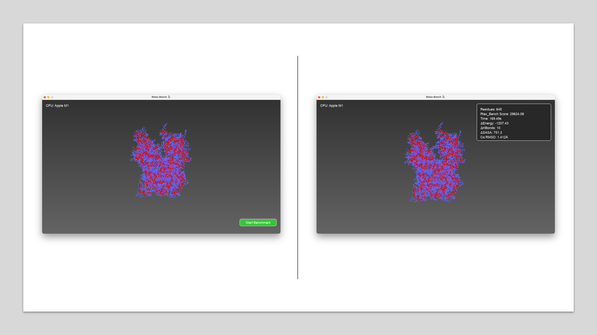
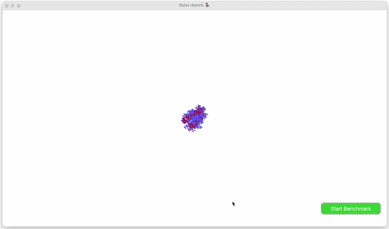

# Relax-Bench 🪑
---
##### Jan 24, 2025 | S.Alireza Hashemi

Github:
[Link](https://github.com/salireza111/Relax_bench)



<div style="text-align: justify"> 
Have you ever dreamed of a wonderland where computer geeks use bio-based problems to assess their new hardware? For instance, they use Relax-Bench instead of Cinebench.
So, I made one for my imaginary world, Relax-Bench: A bio-based hardware benchmark tool that can score your CPU based on the pyRosetta relaxation platform, a combination of time and effectiveness to calculate and relax a single protein (obviously for version 1 :) </div>


<div style="text-align: justify"> 

This tool was developed based on pyrosetta relaxation combined with a handmade PDB visualizer to make it a little more visually appealing and the power to see each of the relaxed trajectories. 

</div>


#### 1- Set the scene  &emsp; &emsp;  &emsp; &emsp;        2- Hit the start button  &emsp; &emsp; &emsp; &emsp; 3- Wait till see the result  &emsp; &emsp;




### Compare your CPU

| CPU            | Score   | Time  |
| -----------    | ------ | ------ |
| `M1`           |  29624 | 169sec |
| `12100F`       |  27085 | 262sec |
| `Your CPU :) ` | [Submit it](https://docs.google.com/forms/d/e/1FAIpQLSeA7G9HrApUzfOurF2i9OKnAjhgxtBo6RwPhsiBG1x4JTcA7A/viewform?usp=dialog) |


#### A little into it

##### Basics for visualisation

```
WIDTH, HEIGHT = 1280, 720
FONT_SIZE = 18
COLORS = {
    'background': (30, 30, 30),
    'button': (50, 200, 50),
    'hover': (70, 220, 70),
    'text': (255, 255, 255),
    'backbone': (200, 25, 25),      
    'other_atoms': (100, 100, 255),   
    'bond': (10, 10, 10),             
    'panel_bg': (40, 40, 40),
    'panel_border': (200, 200, 200),
    'button_border': (180, 180, 180),
    'gradient_start': (50, 50, 50),
    'gradient_end': (100, 100, 100),
    'button_highlight': (100, 250, 100),
}

```

##### Feel free to remove barriers to how much you can zoom in

```
class PDBViewer:

...

 self.view = {
            'angle_x': 0,
            'angle_y': 0,
            'distance': 300,
            'fov': 1000,
            'dragging': False
        }
```

##### And here you have the ability to change the relaxation setup, by minimizing the iteration you can watch the atomic wobbeling with more details

```
class RelaxationController:

...

   def run_relaxation(self): 
        start_time = time.time()
        start_mem = psutil.Process().memory_info().rss

        scorefxn = get_fa_scorefxn()
        mm = MoveMap()
        mm.set_bb(True)
        mm.set_chi(True)

        min_mover = MinMover()
        min_mover.movemap(mm)
        min_mover.score_function(scorefxn)
        min_mover.max_iter(8)

        energy_initial = scorefxn.score(self.pose)

        for loop in range(120):  
            if not self.running:
                break

            iter_start = time.time()
            min_mover.apply(self.pose)

            energy_current = scorefxn.score(self.pose)

            if self.check_convergence(energy_initial, energy_current, energy_threshold=0.1):
                print(f"Relaxation stopped at loop {loop} due to minimal energy change.")
                break  

            energy_initial = energy_current  

```

##### And change the path for your designated PDB

```
if __name__ == "__main__":
    script_dir = os.path.dirname(os.path.abspath(__file__))
    viewer = PDBViewer(script_dir + "/RNR.pdb")  
    viewer.run()

```

!!! warning 
    Note that by changing the iteration, loop, and PDB, the score function is not reliable anymore


 
### Installation guide:

```bash
# Git clone
git clone https://github.com/salireza111/Relax_bench.git

# Create the virtual env (you need cond)
conda env create -f environment.yml

# Activate the environment
conda activate bioenv

# Run the code
python main.py
```
